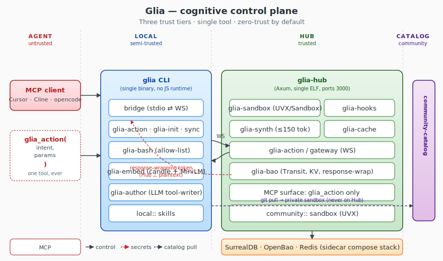

<div align="center">

# Glia

**Cognitive control plane for AI agents.** Replace 50 MCP installs with one
`glia action` call. Local-first, Graph-RAG, zero-trust exec, air-gappable.

[](https://github.com/Vellixia/Glia/actions/workflows/ci.yml)
[](LICENSE)
[](https://www.rust-lang.org)
[](Cargo.toml)
[](#development)
[](#design)

</div>

---

## Why Glia

Every AI agent today ships its own tool registry, its own OAuth dance, its own
secret store, its own per-vendor MCP. That's 50 installs, 50 trust boundaries,
50 places for a credential to leak.

Glia collapses all of that into a single `glia action` call:

- **One tool, every intent** — the agent says *"create a Linear issue for the
  login bug"*; Glia resolves intent → tool → credentials → execution → synthesis.
- **Local-first, zero-trust** — embedded SurrealDB in the CLI, OpenBao for
  secrets, response-wrapping so the Hub never sees plaintext. Disconnect? The
  CLI keeps working from local state.
- **Air-gappable** — `candle` embeddings, model bundled via `rust-embed`, no
  external embedding API, no JS runtime, no C++ toolchain.
- **Stack-aware** — auto-detect Next.js, Supabase, Stripe, etc. on `glia init`,
  and pull only the skills that match.
- **Self-host in 2 minutes** — `docker compose up -d` brings the full stack.

```text
$ glia action --intent "create a Linear issue for the login bug"
```

→ the agent gets either a result, `AUTH_REQUIRED`, `AUTH_TIMEOUT`,
`RULE_VIOLATION`, or `HUB_UNREACHABLE` — and nothing else.

---

## Architecture

<p align="center">
  
</p>

**Three trust tiers, one mental model.**

| Tier                | Component       | Role                                                  |
| ------------------- | --------------- | ----------------------------------------------------- |
| Agent (untrusted)   | MCP client      | Calls `glia_action(intent, params)`. Sees no secrets. |
| Local (semi-trusted)| `glia` CLI      | Embedded SurrealKV, candle embeddings, local skills.  |
| Hub (trusted)       | `glia-hub`      | SurrealDB server, OpenBao, Redis, sandbox dispatcher.  |
| Catalog (community) | `community-catalog` (GitHub) | Pulled into private sandbox, never trusted.    |

The Hub exposes a single tool — `glia_action`. Credentials, prompts, secrets,
chunks, embeddings: none of them ever cross the trust boundary in plaintext.

For the deep dive, see [`docs/ARCHITECTURE.md`](docs/ARCHITECTURE.md).

---

## Quickstart

### Self-host the Hub

```bash
git clone https://github.com/Vellixia/Glia.git
cd Glia
docker compose up -d
```

This brings up the full stack in under two minutes:

| Service    | Port (host) | Port (container) | Healthcheck           |
| ---------- | ----------- | ---------------- | --------------------- |
| `glia-hub` | `3000`      | `3000`           | — (up immediately)    |
| SurrealDB  | `8000`      | `8000`           | — (no shell in image) |
| OpenBao    | `8201`      | `8200`           | `wget /v1/sys/health` |
| Redis      | `6379`      | `6379`           | `redis-cli ping`      |

```bash
docker compose ps
# glia-hub     Up
# openbao      Up (healthy)
# redis        Up (healthy)
# surrealdb    Up
```

### Build the CLI

```bash
cargo build --release -p glia-cli
./target/release/glia --help
```

### First action

```bash
./target/release/glia action --intent "hello"
```

Output:

```json
{
  "intent": { "query": "hello", "stack": null },
  "kind": "Local",
  "skills": [],
  "tools": [],
  "missing": [],
  "outcome": "NotApplicable",
  "finished_at": "2026-06-23T03:39:55.246Z"
}
```

`NotApplicable` means the intent matched no rule locally and no remote was
configured — that's the spec. Add skills via `glia save-skill` or
`glia use <community-tool>` and the same intent will route to a tool.

---

## CLI

```
$ glia --help
Cognitive control plane for AI agents

Usage: glia <COMMAND>

Commands:
  bridge      stdio <-> WebSocket translator. Connects to the Glia Hub `/gateway`
  sync        Bidirectional sync between local and Hub SurrealDB (V15/V16, T22)
  init        Scan repo, detect stacks, batch auth (T19)
  action      Unified tool discover + skill fetch + exec (T9)
  save-skill  Author and register a new local skill (T13)
  use         Pull a community tool from the catalog and register it (T20)
```

| Subcommand   | What it does                                                                                |
| ------------ | ------------------------------------------------------------------------------------------- |
| `init`       | Scan repo, detect stack (Next.js, Supabase, …), batch OAuth, install hooks.                 |
| `action`     | One call to find a tool, fetch the right skill, check creds, exec, synthesize, return.     |
| `save-skill` | Author a new local skill via OpenAI-compatible LLM (or template fallback).                  |
| `use`        | Pull a community skill from the catalog into your private SurrealDB.                        |
| `sync`       | Bidirectional LWW sync between local and Hub SurrealDB; offline status fallback.            |
| `bridge`     | stdio ⇄ WS translator so any agent can use Glia without rewriting its transport.           |

---

## Hub API

The Hub exposes two endpoints:

| Endpoint              | Protocol | Purpose                                              |
| --------------------- | -------- | ---------------------------------------------------- |
| `WS /gateway`         | `ws`     | Unified `glia_action` engine. Bidirectional.         |
| `WS /gateway`         | `ws`     | `AUTH_REQUIRED` async block, ≤ 120s, then timeout.   |
| `GET /health`         | `http`   | 200 once the server is up.                           |

The AI-exposed tool is exactly one:

```text
tool: glia_action(intent:string, params:object)
  → result | AUTH_REQUIRED | AUTH_TIMEOUT | RULE_VIOLATION | HUB_UNREACHABLE
```

---

## Design

The full design lives in [`SPEC.md`](SPEC.md) — goal, constraints, invariants,
tasks, research, bugs. The short version:

### Constraints

- **C1** Rust core (Axum/Tokio) — single binary CLI + Hub.
- **C2** Local embeddings via Rust `candle` (`all-MiniLM-L6-v2`), no external
  embedding API, no JS runtime.
- **C3** OpenBao for secrets; Hub API ⊥ reads plaintext secrets.
- **C4** OpenAI-compatible LLM only (OpenAI, Anthropic, vLLM, Ollama).
- **C5** Redis cache target < 2 ms synthesis response.
- **C7** Single `docker-compose.yml` self-host < 2 min in VPC.
- **C8** Air-gap capable — no vendor lock-in.
- **C9** Community catalog via GitHub repo.
- **C10** SurrealDB — multi-model (doc + graph + vector + SQL), embeddable.
- **C11** OpenBao native dynamic engines; Glia-managed OAuth refresh for SaaS.

### Invariants (highlights)

- **V1** Local intent → embedded SurrealDB, ⊥ Hub network call.
- **V3** Hub API ⊥ plaintext secrets — OpenBao dynamic leases for DB/K8s;
  OpenBao KV stores refresh tokens; Glia exchanges for 15-min access tokens;
  Cubbyhole for per-exec tokens.
- **V6** Every skill embed → `candle` (`all-MiniLM-L6-v2`), ⊥ external API.
- **V9** Dependency probe (`which uvx/npx`) → fallback to Hub sandbox.
- **V14** `AUTH_REQUIRED` WS wait ≤ 120 s, timeout → `AUTH_TIMEOUT`.
- **V16** Embedded CLI SurrealDB ≠ Hub SurrealDB; bidirectional sync, Hub-
  authoritative LWW, dev-local skills namespaced `local::skill_name`.
- **V18** Hub Sandbox exec → 1-time OpenBao response-wrapping token; Sandbox
  unwraps directly against OpenBao, injects into child process env, purges on
  exit. Hub memory ⊥ plaintext secret.
- **V19** Synthesis ≤ 150 tokens. Reweight: `cosine × (1 + 0.1 × edges)`, cap 1.0.

See [`SPEC.md`](SPEC.md) §V for the full list and §R for the research that
backs the choices.

---

## Crate graph

20 crates, no `unsafe` (workspace lint: `unsafe_code = "forbid"`).

```
glia-cli ─┬─ glia-bridge ─── tokio-tungstenite
          ├─ glia-init    ── glia-fs, glia-context, glia-auth, glia-hooks
          ├─ glia-action  ── glia-db, glia-embed, glia-synth
          ├─ glia-author  ── glia-embed, glia-db
          ├─ glia-catalog ── glia-db, glia-embed
          ├─ glia-sync    ── glia-db
          └─ glia-auth    ── tokio, axum

glia-hub ─┬─ glia-sandbox ── glia-bao
          ├─ glia-hooks
          ├─ glia-db
          ├─ glia-cache  ── redis
          ├─ glia-embed
          ├─ glia-synth
          └─ glia-bao    ── openbao
```

Shared infra: `glia-bash` (allow-list + path boundary), `glia-fs`, `glia-chunk`,
`glia-context`.

---

## Community catalog

Skills are GitHub-tracked markdown, in a sibling repo
[`Vellixia/community-catalog`](https://github.com/Vellixia/community-catalog).
The CLI fetches them on `glia use <name>`, runs them in a private sandbox, and
registers them as `community::name` in SurrealDB. They never run on the Hub.

To add a tool: fork the catalog, drop a markdown file under `tools/`, add an
entry to `catalog.json`, open a PR. Full contribution guide:
[`community-catalog/CONTRIBUTING.md`](community-catalog/CONTRIBUTING.md).

---

## Development

```bash
# Format
cargo fmt --all

# Lint (workspace-wide, warnings as errors)
cargo clippy --workspace --all-targets -- -D warnings

# Test (167 tests, including 2 auth-wiring tests)
cargo test --workspace --all-targets
```

CI runs on `ubuntu-latest`, `windows-latest`, `macos-latest` for every push
and PR. The `unsafe_code = "forbid"` and `missing_docs = "warn"` lints are
enforced at the workspace level.

### Project layout

```
.
├── Cargo.toml                      # workspace root
├── SPEC.md                         # goal, constraints, invariants, tasks, bugs
├── Dockerfile.hub                  # multi-stage linux build for the Hub
├── docker-compose.yml              # self-host stack
├── crates/                         # 20-crate workspace
│   ├── glia-cli/                   # the `glia` binary
│   ├── glia-hub/                   # the `glia-hub` binary
│   ├── glia-{action,auth,bao,bash,bridge,catalog,cache,chunk,context,
│   │         db,embed,fs,hooks,init,sandbox,sync,synth,author}/
│   └── …
├── community-catalog/              # local clone of the catalog repo
│   ├── catalog.json
│   └── tools/                      # one .md per skill
├── docs/
│   └── architecture.svg
├── .github/workflows/ci.yml
├── .dockerignore
├── .gitignore
└── LICENSE
```

### Building just the Hub image

```bash
docker build -f Dockerfile.hub -t glia-hub:dev .
```

The Hub is a single linux ELF (`debian:bookworm-slim` runtime). On Windows,
multi-stage is mandatory — the host-built `.exe` can't run in a linux
container.

---

## Status

`v0.1.0` — all 22 tasks (`T1`–`T22`) complete. 167 tests, clippy clean. Full
stack verified up via `docker compose ps`. See [`CHANGELOG.md`](CHANGELOG.md).

| Task    | Status | What                                                       |
| ------- | :----: | ---------------------------------------------------------- |
| T1–T6   |   ✅   | Bridge, FS, glia-bash, Hub gateway, sandbox, dep probe     |
| T7      |   ✅   | SurrealDB embedded + server, graph schema                   |
| T8      |   ✅   | `candle` + `all-MiniLM-L6-v2` via `rust-embed`              |
| T9–T11  |   ✅   | Action, chunking, OpenAI-compatible synthesis              |
| T12–T13 |   ✅   | Redis cache, `glia save-skill`                             |
| T14–T15 |   ✅   | OpenBao deployment + AUTH_REQUIRED WS + localhost callback  |
| T16–T17 |   ✅   | Hook generation, proactive context loading                 |
| T18     |   ✅   | `docker-compose.yml` self-host                              |
| T19–T22 |   ✅   | `glia init`, `glia use`, catalog repo, bidirectional sync   |

---

## Security

- **No `unsafe`** — workspace lint forbids it.
- **No plaintext secrets in Hub memory** — OpenBao response-wrapping; the
  Sandbox unwraps directly. See `docs/ARCHITECTURE.md`.
- **Sandbox** — `glia-bash` allow-list + path boundary, v1 cross-platform.
  Kernel seccomp / `sandbox-exec` deferred (tracked in `SPEC.md` §B).
- **No JS runtime, no C++ toolchain** — `candle` is pure Rust.
- **No external embedding API** — model bundled, ⊥ network on init.

Report vulnerabilities to `security@vellixia.dev` (or open a private security
advisory on GitHub).

---

## Contributing

PRs welcome. The contribution flow:

1. Fork.
2. `cargo test --workspace` must pass on your machine.
3. `cargo clippy --workspace --all-targets -- -D warnings` must pass.
4. `cargo fmt --all -- --check` must pass.
5. Open a PR with a clear description and a test for new behavior.

For community **skills** (not core code), contribute to
[`Vellixia/community-catalog`](https://github.com/Vellixia/community-catalog).

---

## License

Apache-2.0. See [`LICENSE`](LICENSE).

Copyright 2026 The Glia Authors.
