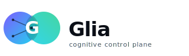

<div align="center">



**Cognitive control plane for AI agents.** One `glia action` call replaces
50 MCP installs. Self-hosted gateway, Graph-RAG, zero-trust exec.

[](https://github.com/Vellixia/Glia/actions/workflows/ci.yml)
[](LICENSE)
[](https://www.rust-lang.org)

</div>

---

## Why

Every AI agent today ships its own tool registry, OAuth dance, secret store,
per-vendor MCP config. The result: 50 installs, 50 trust boundaries,
50 places for a credential to leak. Add a tool and you edit every agent on
every device. A missing runtime crashes silently and the model hallucinates.

Glia solves four concrete problems:

| | Problem | Glia's answer |
|---|---|---|
| **A** | **Secret Exposure** — plaintext API tokens in local config; laptop compromise = full cloud access | Hub is the OAuth broker; laptop never holds a long-lived cred. Per-exec, the Hub mints a short-lived single-use token that is injected into the tool process and purged on exit. |
| **B** | **Dependency Hell** — agent runs `uvx`/`npx` tool, runtime is missing, crashes silently → hallucination | Runtime pre-flight fires **before** exec. Returns structured `RuntimeMissing { runtime, needed_version, hint }` the agent can act on. `glia doctor` reports health. |
| **C** | **N×M Config** — 3 agents × 3 devices = 9 hand-maintained configs; adding one tool = edit all 9 | `glia init` registers one MCP entry per agent. Skills/rules are projected from the Hub. Add a tool once → every agent on every device updates. |
| **D** | **Reactive, not Proactive** — agents only act when reminded; never learn from corrections | File watcher proactively loads stack-relevant context. Corrections loop: dev override → distil candidate rule → human review → Hub upsert → reweighted ranking. |

---

## How it works

Glia is a **self-hosted gateway** — one Hub, many thin clients:

```
AI agent (Claude Code / Cursor)
    │  one MCP tool: glia_action(intent, params)
    ▼
glia CLI / bridge  ← thin client, no local state
    │  HTTP + long-lived WS (Hub must be reachable)
    ▼
┌─────────────── Glia Hub (self-hosted) ────────────────┐
│  classify → discover skills → dep-check → execute      │
│  OAuth broker · per-exec cred mint · sandbox           │
└──────┬────────────┬──────────────┬────────────┬───────┘
       ▼            ▼              ▼            ▼
  HelixDB        OpenBao        Redis       embeddings
(graph+vector)  (secrets)      (cache)   (candle/MiniLM)
```

The Hub exposes a **single** tool to agents:

```
glia_action(intent: string, params: object)
  → result | AUTH_REQUIRED | RUNTIME_MISSING | HUB_UNREACHABLE
```

**Note:** Glia requires the Hub to be reachable. "Self-hosted" means your
infrastructure — you can run the Hub on your own machine — but the CLI
always connects over the network. `HUB_UNREACHABLE` exits with code 2.

## Quickstart

### 1. Start the Hub

```bash
git clone https://github.com/Vellixia/Glia.git
cd Glia
docker compose up -d
docker compose ps
```

| Service    | Port | Notes |
|------------|------|-------|
| `glia-hub` | 3000 | API + WS gateway |
| HelixDB    | 6969 | graph + vector store |
| OpenBao    | 8200 | secrets (dev mode) |
| Redis      | 6379 | cache |

### 2. Build the CLI

```bash
cargo build --release -p glia-cli
./target/release/glia --help
```

### 3. Enroll this device

```bash
./target/release/glia enroll --hub http://127.0.0.1:3000
```

Writes a per-device token to `~/.glia/config.toml`.

### 4. Initialize a project

```bash
cd my-project
glia init --hub http://127.0.0.1:3000
```

Detects your tech stack, registers one MCP bridge entry in each agent's
config (`.claude/settings.json`, `.cursor/mcp.json`), and pulls matching
skills from the Hub.

### 5. Check runtime health

```bash
glia doctor
```

### 6. First action

```bash
glia action --intent "hello"
```

`NotApplicable` means no matching skill yet — add skills via
`glia save-skill` or `glia use <name>`.

## Docs

| Doc | What's in it |
|-----|--------------|
| [architecture.md](docs/architecture.md) | Trust model, data flow, secret plane, crate graph |
| [security.md](docs/security.md) | Threat model, invariants, sandbox, reporting |
| [cli.md](docs/cli.md) | All subcommands, config, state locations |
| [hub.md](docs/hub.md) | Self-host, API, `AUTH_REQUIRED` flow, ops |
| [catalog.md](docs/catalog.md) | Community skills: anatomy, lifecycle, trust |
| [development.md](docs/development.md) | Workspace, CI, release, style |

## Contributing

PRs welcome:

1. Fork.
2. `cargo test --workspace` must pass.
3. `cargo clippy --workspace --all-targets -- -D warnings` must pass.
4. `cargo fmt --all -- --check` must pass.
5. Open a PR with a clear description and a test for new behavior.

Community **skills** (not core code): contribute to
[`Vellixia/community-catalog`](https://github.com/Vellixia/community-catalog).

## License

[Apache-2.0](LICENSE). Copyright 2026 The Glia Authors.
