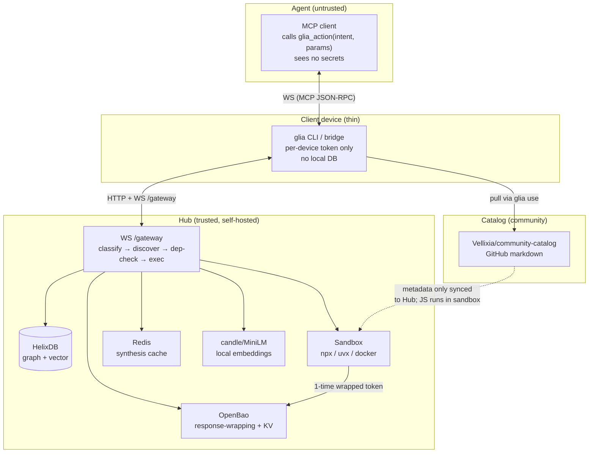
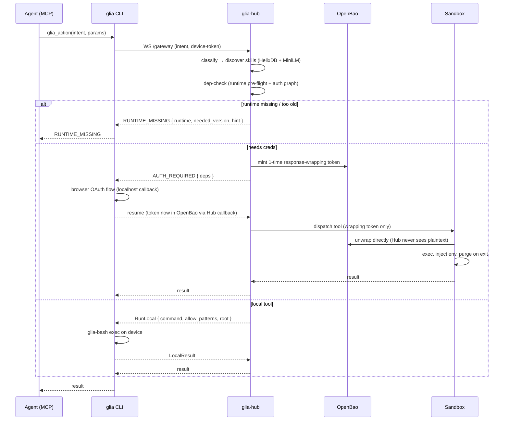
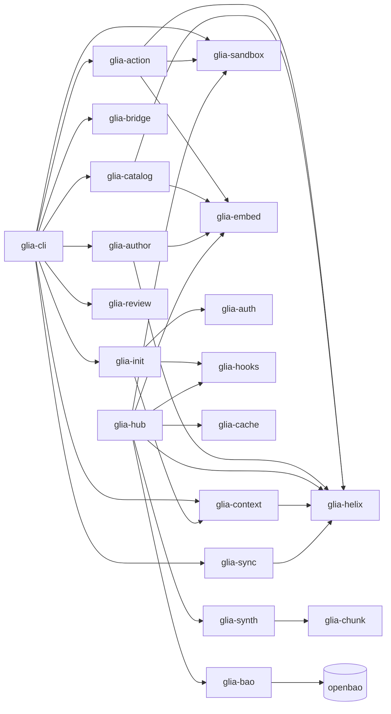

# Architecture

Glia is an **everything-remote** gateway. The Hub is the single source of
truth and the only entity that makes decisions or touches secrets. The CLI
is a thin HTTP/WS client — it holds no authoritative state.

## Trust tiers



The Hub exposes a **single** AI-facing tool:

```text
glia_action(intent: string, params: object)
  → result | AUTH_REQUIRED | RUNTIME_MISSING | HUB_UNREACHABLE
```

## Components

| Tier | Component | Role |
|------|-----------|------|
| Agent | MCP client | Calls `glia_action`. Sees no secrets. |
| Client | `glia` CLI + `glia-bridge` | Thin client — one MCP entry, per-device token, no DB. |
| Hub | `glia-hub` | All decisions: classify, discover, dep-check, exec, OAuth broker. |
| Hub | HelixDB | Skill/tool/provider graph + vector index. Hub-only. |
| Hub | OpenBao | Secrets at rest, response-wrapping, dynamic leases. Hub-only. |
| Hub | Redis | Synthesis + token cache. Hub-only. |
| Hub | candle/MiniLM | Local sentence embeddings (no external API). |
| Hub | Sandbox (`glia-sandbox`) | Runs `npx`/`uvx`/`docker` tools with injected, auto-purged creds. |
| Catalog | `community-catalog` (GitHub) | Pulled as markdown; metadata syncs to Hub; JS executes in sandbox only. |

## Data flow: a single action



## Secret plane (V3, V18)

Three invariants govern secrets end to end:

1. **The Hub API never reads plaintext secrets.** OpenBao KV stores OAuth
   refresh tokens; Cubbyhole holds per-exec access tokens; dynamic leases
   for DB/cloud creds.
2. **The Sandbox unwraps directly against OpenBao.** The Hub issues only a
   response-wrapping token — it never sees the underlying secret in
   plaintext.
3. **Per-exec, short-lived, scoped.** The Hub mints one wrapping token per
   execution; the sandbox unwraps it once, injects the secret as an env var,
   and purges it on drop. A stolen token has a 5-minute blast radius.

## Storage

| Store | Backend | Holds |
|-------|---------|-------|
| Hub DB | HelixDB (server, `:6969`) | Skills, tools, stacks, providers, edges |
| Cache | Redis | Synthesis responses (≤2 ms hot path) |
| Secrets | OpenBao (`:8200` in-container) | Refresh tokens, access tokens, dynamic leases |
| Catalog | GitHub | Markdown skills, versioned |

The CLI has **no local database**. It is a pure HTTP client against the Hub.

## Sandbox (V17)

For **local tools** (`glia-bash`):

- **Allow-list** of binaries (`uvx`, `npx`, `cargo`, `git`, …) — others
  route to the Hub sandbox.
- **Path boundary** — every resolved path must be inside the workspace root;
  `..`, `~`, and absolute paths outside the root are rejected.

For **remote tools** (`glia-sandbox` on the Hub):

- Tool spawned as a child process with `npx`/`uvx`/`docker`.
- Credentials injected as env vars from OpenBao wrapping token; purged on
  drop.
- No host filesystem or network access beyond the tool's declared scope.

v1 is cross-platform. Kernel seccomp (Linux) and `sandbox-exec` (macOS) are
deferred — see `SPEC.md` §B.

## Synthesis (V19)

```text
score = min(1.0, cosine(query, skill) * (1.0 + 0.1 * stack_edges(skill)))
```

Graph-edge boost: a skill that is structurally connected to the matched
stack outranks an isolated but cosinely-similar one. Synthesis is
OpenAI-compatible (Anthropic, vLLM, Ollama).

## Note on "air-gap"

Glia's core embeds no external APIs: embeddings run via `candle`/MiniLM
locally on the Hub; the LLM synthesis backend is configurable (any
OpenAI-compatible endpoint). The system makes no external calls beyond what
you configure. However, the CLI always requires a reachable Hub — air-gap
means "no cloud dependencies for the platform itself," not "offline CLI."

## Crate graph



22 crates, no `unsafe` (workspace lint: `unsafe_code = "forbid"`).
