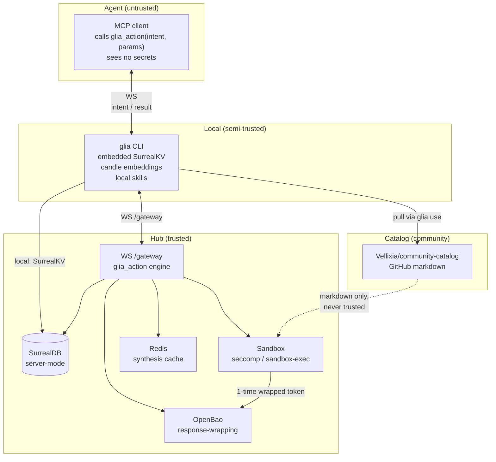
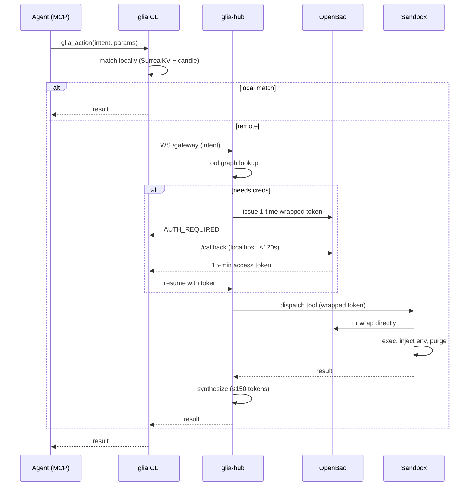
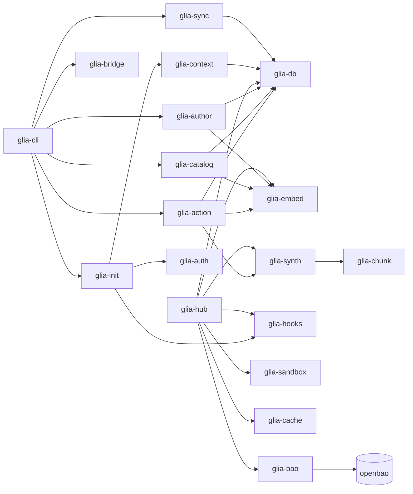

# Architecture

Glia splits a single tool call — `glia_action` — across four trust tiers.
Secrets never cross the trust boundary in plaintext.

## Trust tiers



The Hub exposes a **single** AI-facing tool:

```text
tool: glia_action(intent:string, params:object)
  → result | AUTH_REQUIRED | AUTH_TIMEOUT | RULE_VIOLATION | HUB_UNREACHABLE
```

## Components

| Tier | Component | Role |
|------|-----------|------|
| Agent | MCP client | Calls `glia_action`. Sees no secrets. |
| Local | `glia` CLI | Embedded SurrealKV, candle embeddings, local skills. |
| Hub | `glia-hub` | SurrealDB server, OpenBao, Redis, sandbox dispatcher. |
| Catalog | `community-catalog` (GitHub) | Pulled into private sandbox, never trusted. |

## Data flow: a single action



## Secret plane (V3, V18)

Three rules govern secrets end to end:

1. **The Hub API never reads plaintext secrets.** OpenBao dynamic leases for
   DB/K8s, KV stores refresh tokens, Cubbyhole holds per-exec tokens.
2. **The Sandbox unwraps directly against OpenBao.** The Hub never sees
   plaintext — it only issues a response-wrapping token.
3. **Glia exchanges refresh tokens for 15-min OAuth access tokens** before
   handing them to the sandbox, so a stolen refresh token has a narrow
   blast radius.

## Storage

| Store | Backend | Holds |
|-------|---------|-------|
| Local DB | SurrealKV (embedded) | Skills, tools, stacks, edges |
| Hub DB | SurrealDB (server, in-memory for dev) | Same schema, Hub-authoritative |
| Cache | Redis | Synthesis responses (≤2 ms hot path) |
| Secrets | OpenBao | Refresh + access tokens, DB creds |
| Catalog | GitHub | Markdown skills, versioned |

## Sandbox (V17)

`glia-bash` enforces:

- **Allow-list** of binaries (`uvx`, `npx`, `cargo`, `git`, …) — anything else
  routes back to the Hub sandbox.
- **Path boundary** — every resolved path must be inside a workspace root;
  `..`, `~`, and absolute paths outside the root are rejected.

v1 is cross-platform. Kernel seccomp (Linux) and `sandbox-exec` (macOS) are
deferred — see `SPEC.md` §B.

## Synthesis (V19)

```text
score = min(1.0, cosine(query, skill) * (1.0 + 0.1 * edges(skill)))
output = top-k skills, ≤ 150 tokens
```

Edges boost — a skill that is structurally connected to the matched intent
outranks an isolated but cosinely-similar one. Synthesis is OpenAI-compatible
(OpenAI, Anthropic, vLLM, Ollama).

## Crate graph



20 crates, no `unsafe` (workspace lint: `unsafe_code = "forbid"`).
