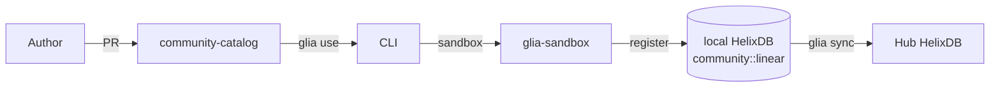

# Community catalog

Skills come from markdown, versioned in a sibling GitHub repo
[`Vellixia/community-catalog`](https://github.com/Vellixia/community-catalog).
The CLI pulls them on `glia use <name>`, runs them in a private sandbox,
and registers them as `community::<name>` in HelixDB.

They **never run on the Hub**.

## Anatomy of a tool

```text
community-catalog/
├── catalog.json                    # registry: name -> source path, deps, tags
└── tools/
    ├── linear.md
    ├── supabase-rls.md
    └── stripe-create-customer.md
```

Each `tools/<name>.md`:

```markdown
# linear

Create issues, list projects, fetch a cycle. Uses Linear's GraphQL API.

## Detects
- `nextjs` (axios/cookies)
- `node` (any)

## Requires
- `LINEAR_API_KEY` (env)

## Tool
```js
// JS sandbox code: getContext({ intent, params })
const q = `query { issues(filter: { title: { contains: "${params.query}" } }) { nodes { id title url } } }`;
return await linearGql(q, ctx.env.LINEAR_API_KEY);
```

## Returns
```json
{ "issues": [ { "id": "...", "title": "...", "url": "..." } ] }
```

## Rules
- One Linear call per action. No bulk write.
```

`catalog.json`:

```json
{
  "version": 1,
  "tools": {
    "linear": {
      "source": "tools/linear.md",
      "stack":  ["nextjs", "node"],
      "tags":   ["issue-tracker"],
      "needs_auth": ["LINEAR_API_KEY"]
    }
  }
}
```

## Lifecycle



1. Author opens a PR to the catalog repo.
2. CI lints the markdown (frontmatter, valid JS, GraphQL/REST shape).
3. After merge, `glia use linear` on any agent host pulls the file.
4. The CLI sandboxes the JS, runs it once to register (validate the
   schema), then drops the file. The Hub never sees the source.
5. On `glia sync`, the registration propagates to the Hub as
   `community::linear`.

## Trust

- **Untrusted** — the catalog is GitHub markdown. Anyone can PR.
- **Sandboxed** — the JS runs in `glia-sandbox` with no host filesystem,
  no network (only loopback to OpenBao for unwrap), and an allow-list of
  imports.
- **Versioned** — `GLIA_CATALOG` pins the catalog to a ref
  (`Vellixia/community-catalog/main` by default). Pin to a SHA in
  production.
- **Revoked** — deleting the file from the catalog or adding it to the
  `revoked` block in `catalog.json` makes `glia use` refuse on the next
  pull.

## Contributing a skill

1. Fork [`Vellixia/community-catalog`](https://github.com/Vellixia/community-catalog).
2. Drop your markdown under `tools/<name>.md`.
3. Add an entry to `catalog.json`.
4. Open a PR. CI will lint and run a dry sandbox.
5. After merge, anyone with the CLI can `glia use <name>`.

Full guide: [`community-catalog/CONTRIBUTING.md`](https://github.com/Vellixia/community-catalog/blob/main/CONTRIBUTING.md).
