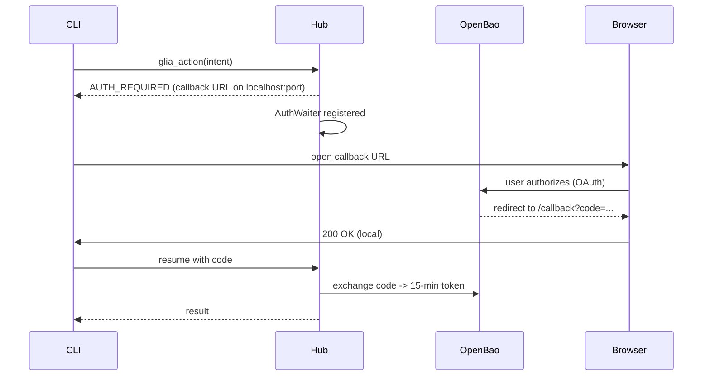
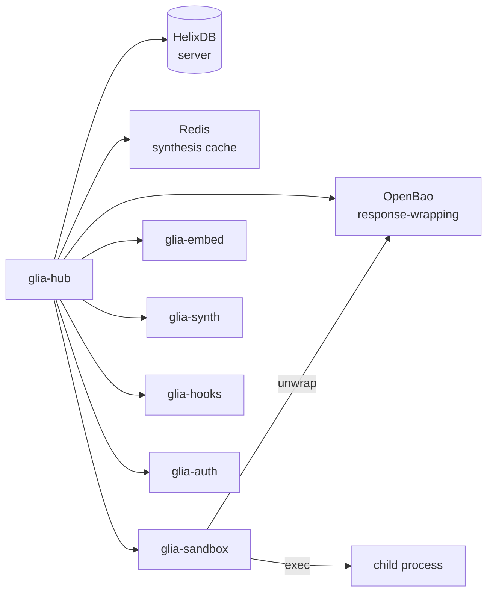

# Hub

`glia-hub` is the trusted tier. It holds no plaintext secrets and exposes a
single AI-facing tool.

## Self-host

```bash
git clone https://github.com/Vellixia/Glia.git
cd Glia
docker compose up -d
```

This brings the full stack in under two minutes:

| Service    | Host port | Container port | Healthcheck |
|------------|-----------|----------------|-------------|
| `glia-hub` | `3000`    | `3000`         | — (up immediately) |
| HelixDB  | `8000`    | `8000`         | — (no shell in image) |
| OpenBao    | `8201`    | `8200`         | `wget /v1/sys/health` |
| Redis      | `6379`    | `6379`         | `redis-cli ping` |

```bash
docker compose ps
# glia-hub     Up
# openbao      Up (healthy)
# redis        Up (healthy)
# HelixDB    Up
```

## Build the Hub image

```bash
docker build -f Dockerfile.hub -t glia-hub:dev .
```

Multi-stage: `rust:1-bookworm` → `debian:bookworm-slim`. The Hub is a
single linux ELF. On Windows, multi-stage is mandatory — the host-built
`.exe` cannot run in a linux container.

## API

The Hub exposes one WebSocket and one HTTP endpoint:

| Endpoint     | Protocol | Purpose |
|--------------|----------|---------|
| `WS /gateway`| `ws`     | Unified `glia_action` engine. Bidirectional. |
| `GET /health`| `http`   | 200 once the server is up. |

### The only tool

```text
tool: glia_action(intent:string, params:object)
  → result | AUTH_REQUIRED | AUTH_TIMEOUT | RULE_VIOLATION | HUB_UNREACHABLE
```

The result is a JSON envelope:

```json
{
  "kind":   "Local" | "Remote" | "Mixed",
  "skills": ["..."],
  "tools":  ["..."],
  "output": "...",
  "tokens": 137,
  "outcome": "Ok" | "AuthRequired" | "AuthTimeout" | "RuleViolation"
              | "HubUnreachable"
}
```

### `AUTH_REQUIRED` flow



- Hub opens a 1-time localhost listener (ephemeral port 0).
- CLI opens the browser to the URL.
- Browser completes OAuth, redirects to `/callback`.
- CLI forwards the code to the Hub.
- Hub exchanges code for a 15-min access token via OpenBao.

If the user does not finish in `GLIA_AUTH_TIMEOUT` (default 120 s), the
Hub returns `AUTH_TIMEOUT` and the CLI surfaces it.

## Components



## Storage

| Store | Backend | Holds |
|-------|---------|-------|
| Hub DB | HelixDB (server-mode, in-memory for dev) | Skills, tools, stacks, edges — Hub-authoritative |
| Cache | Redis | Synthesis responses (≤2 ms hot path) |
| Secrets | OpenBao | Refresh + access tokens, DB creds |

## Environment

| Env var | Default | Purpose |
|---------|---------|---------|
| `Helix_URL` | `ws://HelixDB:8000` | Hub DB |
| `OPENBAO_URL` | `http://openbao:8200` | Secret store |
| `REDIS_URL` | `redis://redis:6379` | Cache |
| `GLIA_AUTH_TIMEOUT` | `120` | seconds |
| `RUST_LOG` | `info` | tracing |

## Operations

- **Logs:** `docker compose logs -f glia-hub`
- **Restart:** `docker compose restart glia-hub`
- **Wipe state:** `docker compose down -v` (also drops OpenBao, HelixDB,
  Redis volumes — destructive).

For production, replace `memory` HelixDB with a persistent backend
(RocksDB or TiKV), front the Hub with TLS, and pin OpenBao to a real
unsealed root.
