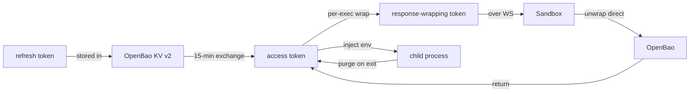

# Security

Glia is designed so a stolen credential, a malicious catalog skill, and a
compromised agent can each do only limited damage. The rules below are
enforced by code, not policy.

## Threat model

| Adversary | What they can touch | What they cannot |
|-----------|---------------------|------------------|
| Malicious agent | MCP client, public tool output | Any secret, any other agent's data |
| Malicious catalog skill | Sandboxed execution, stdout | Host filesystem outside the workspace, network outside OpenBao, other skills' env |
| Compromised Hub host | All Hub logs, response-wrapping tokens | Plaintext secrets (they are never on the Hub) |
| Network observer | Encrypted WS frames | Token contents (response-wrapping + 15-min TTL) |

## Invariants (enforced)

- **No `unsafe`** — workspace lint `unsafe_code = "forbid"`. No raw pointer
  arithmetic, no FFI to skip borrowck, no `transmute`.
- **V3 — Hub API never reads plaintext secrets.** OpenBao dynamic leases for
  DB/K8s; KV stores refresh tokens; Glia exchanges for 15-min OAuth access
  tokens; Cubbyhole for per-exec tokens.
- **V6 — Every skill embed is `candle` (`all-MiniLM-L6-v2`).** No external
  embedding API. The model is bundled via `rust-embed` — even the CLI
  cannot exfiltrate embeddings.
- **V14 — `AUTH_REQUIRED` blocks the WS ≤ 120 s** with a localhost callback.
  If the user does not finish the OAuth dance in time, the call returns
  `AUTH_TIMEOUT` and the agent must retry.
- **V18 — Hub Sandbox exec gets a 1-time OpenBao response-wrapping token.**
  The sandbox unwraps directly against OpenBao, injects into the child
  process env, and purges on exit. The Hub memory never contains the
  plaintext secret.
- **V17 — `glia-bash` allow-list + path boundary.** Every resolved path
  must be inside a workspace root; `..`, `~`, and absolute paths outside
  are rejected. Allow-listed binaries (`uvx`, `npx`, `cargo`, `git`) run
  locally; anything else routes back to the Hub sandbox.

## Secrets at rest and in motion

The Hub never sees `ACC` in plaintext — only `WR`, which is opaque and
single-use.

## Sandbox (v1)

| Check | How |
|-------|-----|
| Binary allow-list | `glia-bash` static list, configurable via `~/.glia/whitelist.toml` |
| Path boundary | Canonicalize; reject if `!starts_with(workspace_root)` |
| Network | Loopback only (callback); outbound via Hub proxy (v2) |
| Syscall filter | seccomp-bpf (Linux), `sandbox-exec` (macOS) — **deferred** to v2 |
| Resource limits | `rlimit` CPU/IO/mem — **deferred** to v2 |

The deferrals are tracked in `SPEC.md` §B. The v1 sandbox is enough to stop
`node_modules` from phoning home, but not enough to stop a determined
attacker from burning CPU.

## Reporting

- **Private security advisory:** GitHub → Security → Advisories → New draft.
- **Email:** `security@vellixia.dev`.
- **PGP:** see `SECURITY.md` at repo root (request key from the address above).

Please do **not** file a public issue for suspected vulnerabilities. We aim
to acknowledge within 48 h and ship a fix within 14 d for critical issues.
